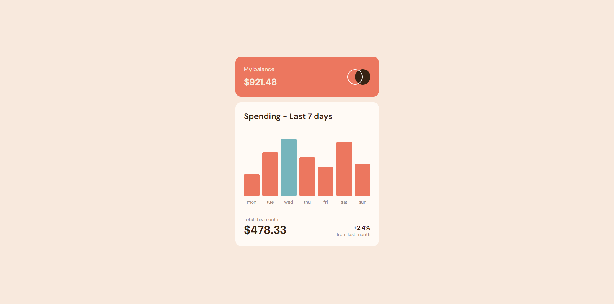
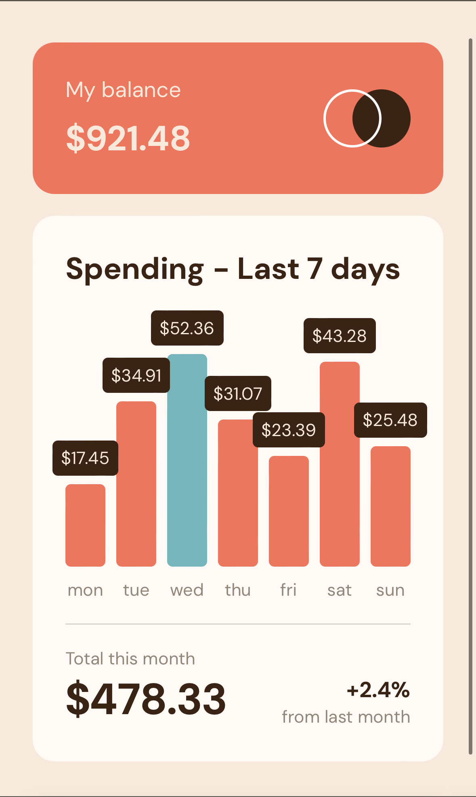

# Frontend Mentor - Expenses chart component solution

This is a solution to the
[Expenses chart component challenge on Frontend Mentor](https://www.frontendmentor.io/challenges/expenses-chart-component-e7yJBUdjwt).
Frontend Mentor challenges help you improve your coding skills by building
realistic projects.

## Table of contents

- [Overview](#overview)
  - [The challenge](#the-challenge)
  - [Screenshot](#screenshot)
  - [Links](#links)
- [My process](#my-process)
  - [Built with](#built-with)
  - [What I learned](#what-i-learned)
  - [Continued development](#continued-development)
- [Author](#author)

## Overview

### The challenge

Users should be able to:

- View the bar chart and hover over the individual bars to see the correct
  amounts for each day
- See the current day’s bar highlighted in a different colour to the other
  bars
- View the optimal layout for the content depending on their device’s
  screen size
- See hover states for all interactive elements on the page
- **Bonus**: Use the JSON data file provided to dynamically size the bars
  on the chart

### Screenshot

 

### Links

- Solution URL:
  [GitHub Repository](https://github.com/simonyanroman/expences-chart-component)
- Live Site URL:
  [Expences Chart Component](https://simonyanroman.github.io/expences-chart-component/)

## My process

### Built with

- [React](https://reactjs.org/) - JS library
- Flexbox
- CSS custom properties
- Semantic HTML5 markup

### What I learned

> As far as i'm mastering **ReactJS** i used what i've learned to complete
> this chellange. My Goal was to create a reusable component, which
> automatically transforms to fetched data. This component actually doesn't
> fetch any data, but it will probably exsit in common app context, so you
> just need to pass necessary data via props.

I implemented several mechanisms which analyze passed data and
conditionally change the look of chart bars.

- This function accepts the array of expences for a certain period of time
  and returns the **maxExpence**

```js
function findMax(array) {
  const result = array.map((item) => item.amount);
  return Math.max(...result);
}
```

Usage:

```js
const [maxExpence, setMaxExpence] = useState(0);

useEffect(() => {
  setMaxExpence(findMax(data));
}, []);
```

```js
<div className={styles.barChart}>
  {data.map((item, id) => (
    <BarChartItem
      key={id}
      item={item}
      maxExpence={maxExpence}
    />
  ))}
</div>
```

- **maxExpence** is used to conditionally render bars in the chart to
  display actual information about expences. It touches not only the color
  of bar, but the height. Height is proportionally counted for each bar and
  result is passed as a property value via _inline styles_. With the help
  of this function, all possible values are mapped from 0 to 100 and are
  used as a percentage for bar height.

```js
function mapToRange(
  num,
  maxExpence,
  minExpence = 0,
  minRange = 0,
  maxRange = 100
) {
  return (
    ((num - minExpence) * (maxRange - minRange)) /
      (maxExpence - minExpence) +
    minRange
  );
}
```

Usage:

```js
<div
  className={styles.barWrapper}
  style={
    item.amount === maxExpence
      ? {
          height: mapToRange(item.amount, maxExpence) + "%",
        }
      : { height: mapToRange(item.amount, maxExpence) + "%" }
  }>
  <div
    className={styles.bar}
    style={
      item.amount === maxExpence
        ? {
            backgroundColor: "var(--cyan)",
          }
        : {}
    }></div>
  <div className={styles.barModal}>
    <h7>${item.amount}</h7>
  </div>
</div>
```

### Continued development

I would like to add several features to my **Chart component** like
_Changing bar direction_ and _Color palette_.

## Author

- LinkedIn - [Roman Simonyan](https://www.linkedin.com/in/simonyanrr)
- Frontend Mentor -
  [@simonyanroman](https://www.frontendmentor.io/profile/simonyanroman)
- Instagram - [@simonyanrr](https://www.instagram.com/simonyanrr)
